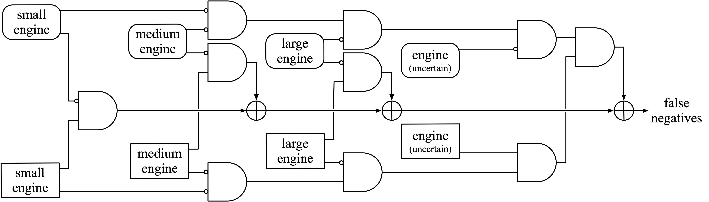
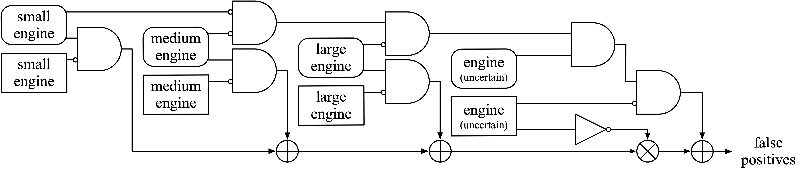
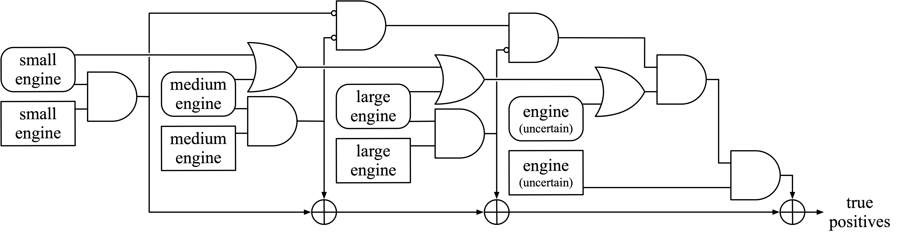
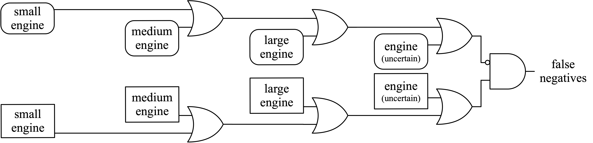
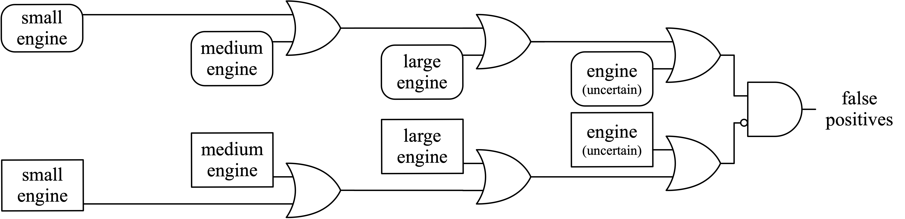
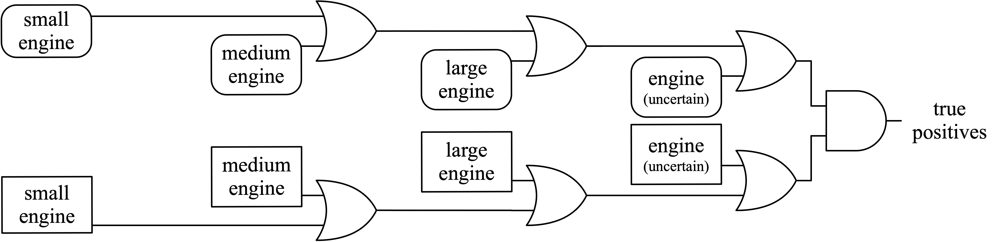

# DCASE 2019 Challenge: Task 5 - Urban Sound Tagging

## Installation
You'll need [Python 3](https://www.python.org/download/releases/3.0/) and [Anaconda](https://www.anaconda.com/distribution/) installed, and will need a bash terminal environment.

Before doing anything else, clone this repository and enter it:

```shell
git clone https://github.com/sonyc-project/urban-sound-tagging-baseline.git
cd urban-sound-tagging-baseline
```

### Quick Start

To get started quickly, simply run:

```shell
# Replace with your preferred directory:
export SONYC_UST_PATH=~/sonyc-ust
./setup.sh
```

### Setup Guide

If you want to go through the motions of setting up the environment, you can follow this guide.

First, set up some environment variables to make things easier for yourself. Feel free to change these to a directory that works better for you.

```shell
export SONYC_UST_PATH=~/sonyc-ust
```

Then set up your Python environment:

```shell
conda create -n ust python=3.6
source activate ust
pip install -r requirements.txt
```

We're using [VGGish](https://github.com/tensorflow/models/tree/master/research/audioset) features as our input representation, so download the required model files:

```shell
mkdir -p $SONYC_UST_PATH/vggish
pushd $SONYC_UST_PATH/vggish
curl -O https://storage.googleapis.com/audioset/vggish_model.ckpt
curl -O https://storage.googleapis.com/audioset/vggish_pca_params.npz
popd
```

Now, download the dataset from [Zenodo](https://zenodo.org/record/2590742) and decompress the audio files:
```shell
mkdir -p $SONYC_UST_PATH/data
pushd $SONYC_UST_PATH/data
wget https://zenodo.org/record/2590742/files/annotations.csv
wget https://zenodo.org/record/2590742/files/audio.tar.gz
wget https://zenodo.org/record/2590742/files/dcase-ust-taxonomy.yaml
wget https://zenodo.org/record/2590742/files/README.md
tar xf audio.tar.gz
rm audio.tar.gz
popd
```

Your environment is now set up!


## Replicating baseline
### Quick Start

To get started immediately (assuming you've set up your environment), you can just run:

```shell
# Replace with your preferred directory:
export SONYC_UST_PATH=~/sonyc-ust
./baseline_example.sh
```

### Baseline Guide


First, set up some environment variables to make things easier. Feel free to change these to a directory that works better for you.

```shell
export SONYC_UST_PATH=~/sonyc-ust
```

Enter the source code directory within the repository:

```shell
cd urban-sound-tagging-baseline
```

Extract embeddings from the SONYC-UST data:

```shell
python extract_embedding.py $SONYC_UST_PATH/data/annotations.csv $SONYC_UST_PATH/data $SONYC_UST_PATH/features $SONYC_UST_PATH/vggish
```

Now, train a fine-level model and produce predictions:

```shell
python classify.py $SONYC_UST_PATH/data/annotations.csv $SONYC_UST_PATH/data/dcase-ust-taxonomy.yaml $SONYC_UST_PATH/features/vggish $SONYC_UST_PATH/output baseline_fine --label_mode fine
```

Evaluate the fine-level model output file (using frame-averaged clip predictions) on AUPRC:

```shell
python evaluate_predictions.py $SONYC_UST_PATH/output/baseline_fine/*/output_mean.csv $SONYC_UST_PATH/data/annotations.csv $SONYC_UST_PATH/data/dcase-ust-taxonomy.yaml
```

Now, train a coarse-level model and produce predictions:

```shell
python classify.py $SONYC_UST_PATH/data/annotations.csv $SONYC_UST_PATH/data/dcase-ust-taxonomy.yaml $SONYC_UST_PATH/features/vggish $SONYC_UST_PATH/output baseline_coarse --label_mode coarse
```

Evaluate the coarse-level model output file (using frame-averaged clip predictions) on AUPRC:

```shell
python evaluate_predictions.py $SONYC_UST_PATH/output/baseline_coarse/*/output_mean.csv $SONYC_UST_PATH/data/annotations.csv $SONYC_UST_PATH/data/dcase-ust-taxonomy.yaml
```

## Baseline Description

For the baseline model, we simply use a multi-label logistic regression model. In other words, we use a single [binary logistic regression](https://towardsdatascience.com/logistic-regression-detailed-overview-46c4da4303bc) model for each tag. Because of the size of the dataset, we opted for a simple and shallow model for our baseline. Our model took VGGish embeddings as its input representation, which by default uses a window size and hop size of 0.96 seconds, giving us ten 128-dimensional embeddings for each clip in our dataset. We use the weak tags for each audio clip as the targets for each clip. For the training data (which has no verified target), we simply count a positive for a tag if at least one annotator has labeled the audio clip with that tag.

We trained the model using stochastic gradient descent (using the [Adam optimizer](http://ruder.io/optimizing-gradient-descent/index.html#adam)) to minimize [binary cross-entropy](https://ml-cheatsheet.readthedocs.io/en/latest/loss_functions.html#cross-entropy) loss. We use [early stopping](https://machinelearningmastery.com/early-stopping-to-avoid-overtraining-neural-network-models/) using loss on the validation set to mitigate overfitting.

For training models to predict tags at the fine level, the loss is modified such that if "unknown/other" is annotated for a particular coarse tag, the loss for the fine tags corresponding to this coarse tag are masked out. This is done because we do not know which of the corresponding fine tags may or may not be active; "unknown/other" implies that any of the corresponding fine tags may or may not be active. However, we still want to use these examples to train the model on fine tags in other coarse categories for which we do have certainty. 

For inference, we predict tags at the frame level and simply take the average of output tag probabilities as the clip-level tag probabilities.


## Baseline Results


## Metrics Description

### Fine AUPRC







### Coarse AUPRC




