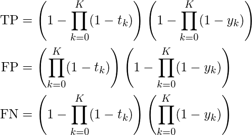
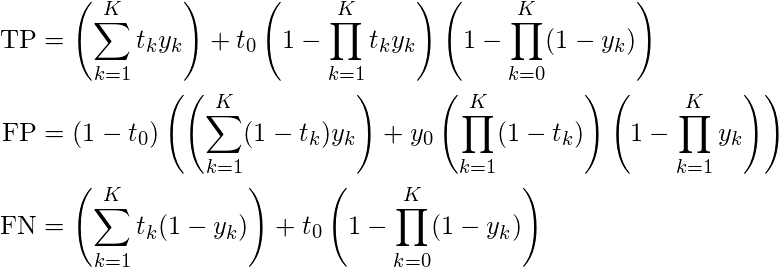

# DCASE 2019 Challenge: Task 5 - Urban Sound Tagging

This repository contains code to reproduce the baseline results and evaluate system outputs for [Task 5 (Urban Sound Tagging)](http://dcase.community/challenge2019/task-urban-sound-tagging) of the the [DCASE 2019 Challenge](http://dcase.community/challenge2019). We encourage participants to use this code as a starting point for manipulating the dataset and for evaluating their system outputs.

## Installation
You'll need [Python 3](https://www.python.org/download/releases/3.0/) and [Anaconda](https://www.anaconda.com/distribution/) installed, and will need a bash terminal environment.

Before doing anything else, clone this repository and enter it:

```shell
git clone https://github.com/sonyc-project/urban-sound-tagging-baseline.git
cd urban-sound-tagging-baseline
```

### Quick Start

To get started quickly, simply run:

```shell
# Replace with your preferred directory:
export SONYC_UST_PATH=~/sonyc-ust
./setup.sh
```

### Setup Guide

If you want to go through the motions of setting up the environment, you can follow this guide.

First, set up some environment variables to make things easier for yourself. Feel free to change these to a directory that works better for you.

```shell
export SONYC_UST_PATH=~/sonyc-ust
```

Then set up your Python environment:

```shell
conda create -n sonyc-ust python=3.6
source activate sonyc-ust
pip install -r requirements.txt
```

We're using [VGGish](https://github.com/tensorflow/models/tree/master/research/audioset) features as our input representation, so download the required model files:

```shell
mkdir -p $SONYC_UST_PATH/vggish
pushd $SONYC_UST_PATH/vggish
curl -O https://storage.googleapis.com/audioset/vggish_model.ckpt
curl -O https://storage.googleapis.com/audioset/vggish_pca_params.npz
popd
```

Now, download the dataset from [Zenodo](https://zenodo.org/record/2590742) and decompress the audio files:
```shell
mkdir -p $SONYC_UST_PATH/data
pushd $SONYC_UST_PATH/data
wget https://zenodo.org/record/2590742/files/annotations.csv
wget https://zenodo.org/record/2590742/files/audio.tar.gz
wget https://zenodo.org/record/2590742/files/dcase-ust-taxonomy.yaml
wget https://zenodo.org/record/2590742/files/README.md
tar xf audio.tar.gz
rm audio.tar.gz
popd
```

Your environment is now set up!


## Replicating baseline
### Quick Start

To get started immediately (assuming you've set up your environment), you can just run:

```shell
# Replace with your preferred directory:
export SONYC_UST_PATH=~/sonyc-ust
./baseline_example.sh
```

### Baseline Guide

First, activate your conda environment (if it isn't already activated).

```shell
source activate sonyc-ust
```

Then, set up some environment variables to make things easier. Feel free to change these to a directory that works better for you.

```shell
export SONYC_UST_PATH=~/sonyc-ust
```

Enter the source code directory within the repository:

```shell
cd urban-sound-tagging-baseline
```

Extract embeddings from the SONYC-UST data:

```shell
python extract_embedding.py $SONYC_UST_PATH/data/annotations.csv $SONYC_UST_PATH/data $SONYC_UST_PATH/features $SONYC_UST_PATH/vggish
```

Now, train a fine-level model and produce predictions:

```shell
python classify.py $SONYC_UST_PATH/data/annotations.csv $SONYC_UST_PATH/data/dcase-ust-taxonomy.yaml $SONYC_UST_PATH/features/vggish $SONYC_UST_PATH/output baseline_fine --label_mode fine
```

Evaluate the fine-level model output file (using frame-averaged clip predictions) on AUPRC:

```shell
python evaluate_predictions.py $SONYC_UST_PATH/output/baseline_fine/*/output_mean.csv $SONYC_UST_PATH/data/annotations.csv $SONYC_UST_PATH/data/dcase-ust-taxonomy.yaml
```

Now, train a coarse-level model and produce predictions:

```shell
python classify.py $SONYC_UST_PATH/data/annotations.csv $SONYC_UST_PATH/data/dcase-ust-taxonomy.yaml $SONYC_UST_PATH/features/vggish $SONYC_UST_PATH/output baseline_coarse --label_mode coarse
```

Evaluate the coarse-level model output file (using frame-averaged clip predictions) on AUPRC:

```shell
python evaluate_predictions.py $SONYC_UST_PATH/output/baseline_coarse/*/output_mean.csv $SONYC_UST_PATH/data/annotations.csv $SONYC_UST_PATH/data/dcase-ust-taxonomy.yaml
```

## Baseline Description

For the baseline model, we simply use a multi-label logistic regression model. In other words, we use a single [binary logistic regression](https://towardsdatascience.com/logistic-regression-detailed-overview-46c4da4303bc) model for each tag. Because of the size of the dataset, we opted for a simple and shallow model for our baseline. Our model took VGGish embeddings as its input representation, which by default uses a window size and hop size of 0.96 seconds, giving us ten 128-dimensional embeddings for each clip in our dataset. We use the weak tags for each audio clip as the targets for each clip. For the training data (which has no verified target), we simply count a positive for a tag if at least one annotator has labeled the audio clip with that tag.

We trained the model using stochastic gradient descent (using the [Adam optimizer](http://ruder.io/optimizing-gradient-descent/index.html#adam)) to minimize [binary cross-entropy](https://ml-cheatsheet.readthedocs.io/en/latest/loss_functions.html#cross-entropy) loss. We use [early stopping](https://machinelearningmastery.com/early-stopping-to-avoid-overtraining-neural-network-models/) using loss on the validation set to mitigate overfitting.

For training models to predict tags at the fine level, the loss is modified such that if "unknown/other" is annotated for a particular coarse tag, the loss for the fine tags corresponding to this coarse tag are masked out. This is done because we do not know which of the corresponding fine tags may or may not be active; "unknown/other" implies that any of the corresponding fine tags may or may not be active. However, we still want to use these examples to train the model on fine tags in other coarse categories for which we do have certainty. 

For inference, we predict tags at the frame level and simply take the average of output tag probabilities as the clip-level tag probabilities.


## Metrics Description

The Urban Sound Tagging challenge is a task of multilabel classification. To evaluate and rank participants, we ask them to submit a CSV file following a similar layout as the publicly available CSV file of the development set: in it, each row should represent a different ten-second snippet, and each column should represent an urban sound tag.

The area under the precision-recall curve (AUPRC) is the classification metric that we employ to rank participants. To compute this curve, we threshold the confidence of every tag in every snippet by some fixed threshold tau, thus resulting in a one-hot encoding of predicted tags. Then, we count the total number of true positives (TP), false positives (FP), and false negatives (FN) between prediction and consensus ground truth over the entire evaluation dataset.

The Urban Sound Tagging challenge provides two leaderboards of participants, according to two distinct metric: fine-grained AUPRC and coarse-grained AUPRC. In each of the two levels of granularity, we vary tau between 0 and 1 and compute TP, FP, and FN for each coarse category. Then, we compute micro-averaged precision P = TP / (TP + FP) and recall R = TP / (TP + TN), giving an equal importance to every sample. We repeat the same operation for all values of tau in the interval [0, 1] that result in different values of P and R. Lastly, we use the trapezoidal rule to estimate the AUPRC.

The computations can be summarized by the following expressions defined for each coarse category, where `t_0` and `y_0` correspond to the presence of an incomplete tag in the ground truth and prediction (respectively), and `t_k` and `y_k` (for `k = 1, ..., K`) correspond to the presence of fine tag `k` in the ground truth and prediction (respectively).



For samples with complete ground truth (i.e., in the absence of the incomplete fine tag in the ground truth for the coarse category at hand), evaluating urban sound tagging at a fine level of granularity is also relatively straightforward. Indeed, for samples with complete ground truth, the computation of TP, FP, and FN amounts to pairwise conjunctions between predicted fine tags and corresponding ground truth fine tags, without any coarsening. Each fine tag produces either one TP (if it is present and predicted), one FP (if it it absent yet predicted), or one FN (if it is absent yet not predicted). Then, we apply one-hot integer encoding to these boolean values, and sum them up at the level of coarse categories before micro-averaging across coarse categories over the entire evaluation dataset. In this case, the sum (TP+FP+FN) is equal to the number of tags in the fine-grained taxonomy, i.e. 23. Furthermore, the sum (TP+FN) is equal to the number of truly present tags in the sample at hand.

The situation becomes considerably more complex when the incomplete fine tag is present in the ground truth, because this presence hinders the possibility of precisely counting the number of false alarms in the coarse category at hand. We propose a pragmatic solution to this problem; the guiding idea behind our solution is to evaluate the prediction at the fine level only when possible, and fall back to the coarse level if necessary.

For example, if a small engine is present in the ground truth and absent in the prediction but an "other/unknown" engine is predicted, then it's a true positive in the coarse-grained sense, but a false negative in the fine-grained sense. However, if a small engine is absent in the ground truth and present in the prediction, then the outcome of the evaluation will depend on the completeness of the ground truth for the coarse category of engines. If this coarse category is complete (i.e. if the tag "engine of uncertain size" is absent from the ground truth), then we may evaluate the small engine tag at the fine level, and count it as a false positive. Conversely, if the coarse category of engines is incomplete (i.e. the tag "engine of uncertain size" is present in the ground truth), then we fall back to coarse-level evaluation for the sample at hand, and count the small engine prediction as a true positive, in aggregation with potential predictions of medium engines and large engines.

The computations can be summarized by the following expressions defined for each coarse category, where `t_0` and `y_0` correspond to the presence of an incomplete tag in the ground truth and prediction (respectively), and `t_k` and `y_k` (for `k = 1, ..., K`) correspond to the presence of fine tag `k` in the ground truth and prediction (respectively).



As a secondary metric, we report the micro-averaged F-score of the system, after fixing the value of the threshold to 0.5. This score is the harmonic mean between precision and recall: F = 2\*P\*R / (P + R). We only provide the F-score metric for purposes of post-hoc error analysis and do not use it at the time of producing the official leaderboard.


## Baseline Results

### Fine-level model

#### Fine-level evaluation:

* Micro AUPRC: 0.6717253550113078
* Micro F1-score (@0.5): 0.5015353121801432
* Macro AUPRC: 0.427463730110938
* Coarse Tag AUPRC:
                                                         
    | Coarse Tag Name | AUPRC |
    | :--- | :--- |
    | engine | 0.7122944027927718 |
    | machinery-impact | 0.19788462073882798 |
    | non-machinery-impact | 0.36403054299960413 |
    | powered-saw | 0.3855391333457478 |
    | alert-signal | 0.6359773072562782 |
    | music | 0.21516455980970542 |
    | human-voice | 0.8798293427878373 |
    | dog | 0.0289899311567318 |

#### Coarse-level evaluation:

* Micro AUPRC: 0.7424913328250053
* Micro F1-score (@0.5): 0.5065590312815338
* Macro AUPRC: 0.5297273551638281

* Coarse Tag AUPRC:                                      
                                                         
    | Coarse Tag Name | AUPRC |
    | :--- | :--- |
    | engine | 0.8594524913674696 |
    | machinery-impact | 0.28532090723421905 |
    | non-machinery-impact | 0.36403054299960413 |
    | powered-saw | 0.7200903371047481 |
    | alert-signal | 0.7536308641644877 |
    | music | 0.282907929536143 |
    | human-voice | 0.9433958377472215 |
    | dog | 0.0289899311567318 |

### Coarse-level model

#### Coarse-level evaluation:
* Micro AUPRC: 0.761602033798918
* Micro F1-score (@0.5): 0.6741035856573705
* Macro AUPRC: 0.5422528970239988
* Coarse Tag AUPRC:
                                                         
    | Coarse Tag Name | AUPRC |
    | :--- | :--- |
    | engine | 0.8552225117097685 |
    | machinery-impact | 0.3595869306870976 |
    | non-machinery-impact | 0.36067068831072385 |
    | powered-saw | 0.6779980935124421 |
    | alert-signal | 0.8126810682348001 |
    | music | 0.2988632647455638 |
    | human-voice | 0.94516997783423 |            
    | dog | 0.02783064115736446 |

### Appendix: taxonomy of SONYC urban sound tags

We reproduce the classification taxonomy of the DCASE Urban Sound Challenge in the diagram below. Rectangular and round boxes respectively denote coarse and fine complete tags. For the sake of brevity, we do not explicitly show the incomplete fine tag in each coarse category.


